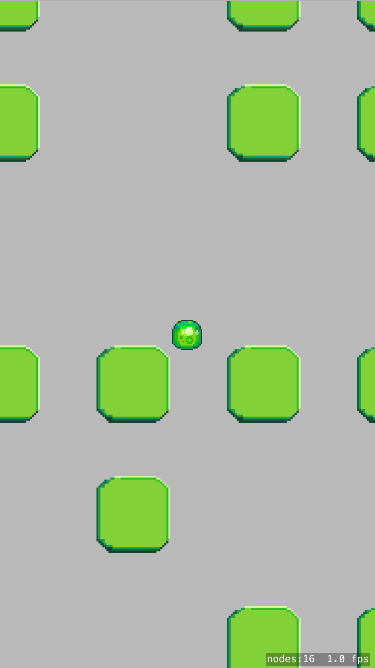

Here is a non-exhaustive list of things you can do with iOS accelerometers:

1. [Compel random strangers to throw their phone as hard as they can](http://kotaku.com/apple-rejected-this-game-to-keep-you-from-killing-your-1028026145)
2. [Prank someone for using an 8 year old Macbook](https://youtu.be/aBJQ5085kSo?t=26s)
3. [Make an actually useful app for some reason](https://itunes.apple.com/us/app/pedometer++/id712286167?mt=8)

# What you will learn

This tutorial will show you how to access accelerometer data and use it in a game.

# The finished product

You'll make a randomized "labyrinth" to explore with an adorable physics blob.

# Feedback

If you have feedback on this tutorial, please open issues on the [GitHub Repository](https://github.com/MakeSchool-Tutorials/Accelerometer-SpriteKit-Swift).
