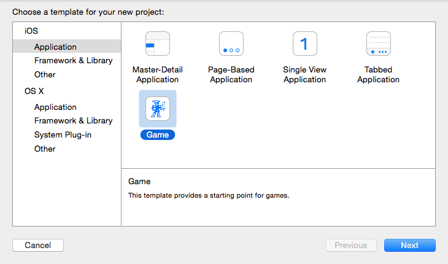
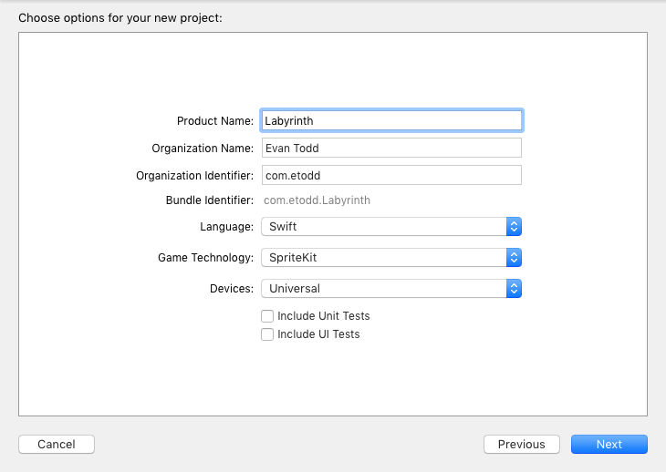
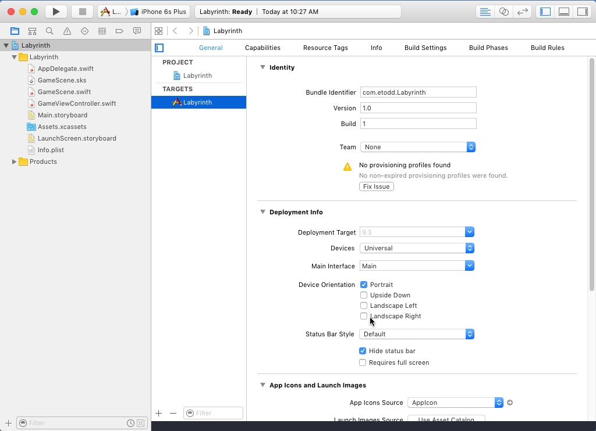

> [action]
> Make a new game project.
> 
> Make it a Swift/SpriteKit project. Disable Unit Tests and UI Tests. This is game development, we don't write tests, we have QA.
> 

<!-- -->

> [action]
> Download the [Accelerometer Assets](https://github.com/MakeSchool-Tutorials/Accelerometer-SpriteKit-Swift/blob/master/AccelerometerAssets.zip), extract the zip, and drag the `assets.atlas` folder into the project to create a texture atlas. Ensure "Copy items if needed" and "Create groups" are checked.

<!-- -->

We're going to be tilting the device a lot in this game, so we don't want auto-rotate messing things up.

> [action]
> In the target settings, disable landscape orientations.
> 