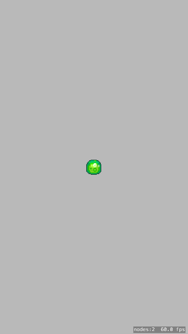

# Remove existing code

> [action]
> Clean out the `GameScene.swift` file like it's a new PC with a bunch of default OEM crap installed.
>
> It should look like this:
>
```swift
import SpriteKit
class GameScene: SKScene {
	override func didMoveToView(view: SKView) {
	}
>
	override func update(currentTime: CFTimeInterval) {
	}
}
```
> If you want, you can also delete `Spaceship` from the `Assets.xcassets` file.
> 
> Run the project just to make sure everything's working.

# Load sprites manually

We're going to do things the hard way. Don't ask why.

> [action]
> Add the following code to `didMoveToView()`:
```swift
// load the texture atlas
let atlas = SKTextureAtlas(named: "assets")
>
// create blob sprite
let blob = SKSpriteNode(texture: atlas.textureNamed("blob"))
>
// center the blob on the screen
blob.position = CGPointMake(self.size.width * 0.5, self.size.height * 0.5)
>
// add it to the scene!
self.addChild(blob)
```

Run your project and you should see what looks like a serious Game of the Year contender.



# Add physics

> [action]
> Add the following code to `didMoveToView()`:
```swift
// set up blob physics
blob.physicsBody = SKPhysicsBody(circleOfRadius: blob.size.width * 0.5)
blob.physicsBody!.mass = 1
```

Run your project and you should see the blob fall off the screen.

# Accelerometer code

If you're skimming through this tutorial, here's where the rubber meets the road.

> [action]
> We use the CoreMotion library for accelerometer data. Add the following code at the top of `GameScene.swift`:
```swift
import CoreMotion
```
> We need a `CMMotionManager`. Add this property to `GameScene`:
```swift
let motionManager = CMMotionManager()
```
> Add the following code to `didMoveToView()` to initialize the accelerometer:
```swift
// initialize accelerometer
if motionManager.accelerometerAvailable {
	motionManager.startAccelerometerUpdates()
}
```
> Now we need to query the accelerometer every frame and set the world's gravity accordingly. Add the following code to `update()`:
```swift
// update gravity based on accelerometer
if let data = motionManager.accelerometerData {
	self.physicsWorld.gravity = CGVectorMake(CGFloat(data.acceleration.x), CGFloat(data.acceleration.y))
}
```
> In case the accelerometer is unavailable, let's set the default gravity to zero in `didMoveToView()`:
```swift
// no gravity by default
self.physicsWorld.gravity = CGVectorMake(0, 0)
```

Run your project on a physical device and you should be able to move the sprite around by tilting the device!