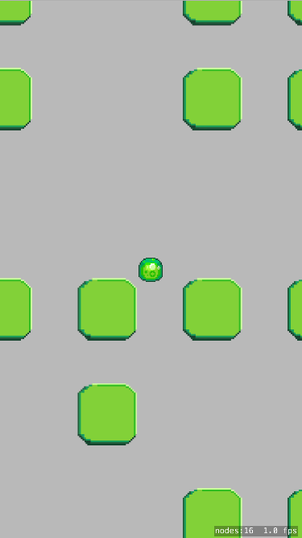

# Add blocks

Let's add some physics blocks for our blob to bounce off of.

> [action]
> Add the following code to `didMoveToView()`:
```swift
// add physics blocks
for x in 0..<10 {
    for y in 0..<10 {
        let block = SKSpriteNode(texture: atlas.textureNamed("block"))
        self.addChild(block)
        block.physicsBody = SKPhysicsBody(rectangleOfSize: block.size)
        block.physicsBody!.dynamic = false
        block.physicsBody!.affectedByGravity = false
        block.position = CGPointMake(CGFloat(x) * 150, CGFloat(y) * 150)
    }
}
```

Run the game. Yay, physics!


# Variety is the spice of life

Turns out, a rigid grid of blocks is pretty boring. Let's spice it up by adding some randomness, like this:



> [action]
> Take all the code inside the for loops we just made, and wrap it inside this `if` statement:
```swift
if arc4random() % 2 == 0 { // random chance of spawning a block
}
```

The statement above generates a random number, then checks if it is divisible by 2. The modulo operator (%) divides two integers and returns the remainder. If the remainder is 0, the number is divisible by 2. What are the odds that a random number is divisible by 2?

> [solution]
> 50/50!

How could you decrease the odds that a block will be spawned?

> [solution]
> Use modulo with a larger number, like 5:
```swift
if arc4random() % 5 == 0 {
}
```
Now there is only a 1 in 5 chance that a block will be spawned.

How could you increase the odds above 50%?

> [solution]
> You don't have to check if the result of the modulo is equal to a specific number. You can also use "less than" and "greater than" comparisons.
```swift
if arc4random() % 5 < 3 {
}
```
Now there is a 3 in 5 chance that a block will be spawned.

# Make the camera follow

We can't go very far without the blob going off screen, so let's make the camera follow it.

> [action]
> Add the following code to `didMoveToView()`:
```swift
// make the camera follow the blob
self.anchorPoint = CGPointMake(0.5, 0.5) // center the camera view
let cameraNode = SKCameraNode()
blob.addChild(cameraNode) // camera position is now determined relative to the blob
self.camera = cameraNode
```

Run the game. You're now free to roam!
